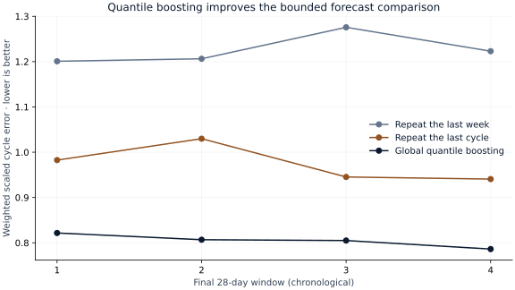
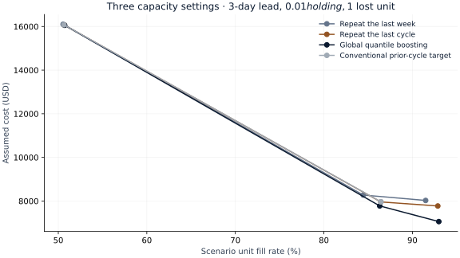

# S02 — Inventory forecasting evaluation

Run `S02-5145fea6-e598f30c` · analysis commit `5145fea621938bb3455655a685897dfa69a2cd83` · 2026-09-29.

## Decision and executive summary

A replenishment planner needs both an accurate sales forecast and an explicit service/cost tradeoff. On 210 product/store series across four final 28-day windows, global quantile boosting reduces the primary cycle forecast error by **17.4%** against repeating the previous cycle. The challenger-minus-baseline difference is **-0.1697** (95% item-cluster interval **-0.2554 to -0.0885**). Lower is better. This supports further operational validation, not a promise of realized savings.

In the default replay—three-day lead time, $0.01 holding per unit/day, $1 per lost unit, storage equal to prior-cycle sales—the challenger costs **$7,775.46 versus $7,962.33** under the assumed costs. It nevertheless loses **4,190 versus 4,149 scenario units**. Lower cost and better service are different objectives. Recorded sales are not unconstrained demand, and actual inventory, margins and costs are unavailable.

## Measured forecast evidence

| Model | Cycle error ↓ (95% interval) | Scaled pinball ↓ | 80% band coverage |
|---|---:|---:|---:|
| Repeat the last week | 1.2265 (1.0864–1.4269) | 1.3226 | 74.6% |
| Repeat the last cycle | 0.9746 (0.8079–1.1151) | 1.2186 | 76.4% |
| Global quantile boosting | 0.8049 (0.6935–0.8982) | 1.1187 | 88.3% |

The 840 final product/store cycles contain 30,600 recorded unit sales. This is a fixed 21-item assortment spanning all ten stores and seven departments, selected using identifiers and pre-tuning price availability. Results do not describe all 30,490 source series. The cycle-total metric differs from the competition's daily WRMSSE. Revenue weights and scale denominators use only eligible prior observations.

The 80% forecast bands cover 88.3% of final bottom-level cycles for the challenger; that aggregate number does not imply calibrated coverage for each store or future period. Store/category/total tables, all four origins, subgroup failures and dependence ablations remain in the result JSON. Aggregate scenarios sum exactly; marginal quantiles are not additive. The 17 overlapping calibration windows provide limited support for uncertainty and cross-series dependence.

## Explicit inventory scenario

| Policy | Assumed cost | Lost scenario units | Cost minus conventional (95% interval) |
|---|---:|---:|---:|
| Repeat the last week | $8,274.43 | 4,761 | $312.10 ($148.03 to $506.40) |
| Repeat the last cycle | $7,958.71 | 4,151 | $-3.62 ($-20.84 to $18.28) |
| Global quantile boosting | $7,775.46 | 4,190 | $-186.87 ($-499.28 to $-18.61) |
| Conventional prior-cycle target | $7,962.33 | 4,149 | $0.00 ($0.00 to $0.00) |

The same initial stock, one-order constraint, arrival date and capacity apply to every policy and to the exact hindsight comparator. Hindsight cost is $6,782.22 in this default setting; the challenger regret is $993.24. This is a constrained simulator comparison, not an achievable observed retailer saving. All 36 prespecified combinations of lead time, holding, lost-sale penalty and storage remain visible. Boosting has lower assumed total cost than the conventional target in all 36 tested settings; that finite sensitivity grid is not a universal guarantee.

## Method and uncertainty

Two leaf-count settings are compared only at d_1689. The selected 15-leaf quantile models use lagged sales, deterministic calendar fields, known item/store categories and completed-week prices. Models refit on eligible past examples at every forecast origin. Training labels must finish before each origin. The 17 intermediate calibration origins precede all final windows. The final four 28-day windows are non-overlapping; later rolling fits may learn earlier realized outcomes without changing settings.

Whole residual-rank vectors construct joint quantile scenarios. An independent-rank ablation illustrates sensitivity of aggregate intervals to dependence. The 256 draws do not constitute 256 independent observed histories. Paired resampling of 21 item clusters retains each item's ten stores and four dates. These intervals are conditional on the fixed stores, dates and fitted models. They do not establish population representativeness or capture future economic-regime uncertainty.

There are no observed stock levels or stockout flags. No purchase cost, ordering fee, spoilage or real margin is assumed known. The service/cost decision is an explicitly hypothetical replay of observed sales. Source dates, sums and prices are not evidence of deployment outcomes. Independent technical review is pending.

## Reproduction

[DATA.md](DATA.md) records exact organizer downloads and checksums; raw files stay outside the repository. [PROTOCOL.md](PROTOCOL.md) fixes the split and evaluation before fitting. Run the commands in [README.md](README.md). The result contains versioned metrics and aggregate tables; `scripts/report_s02.py` exports this report and figures. The external verification artifact retains final predictions for arithmetic checks without publishing individual series histories.
