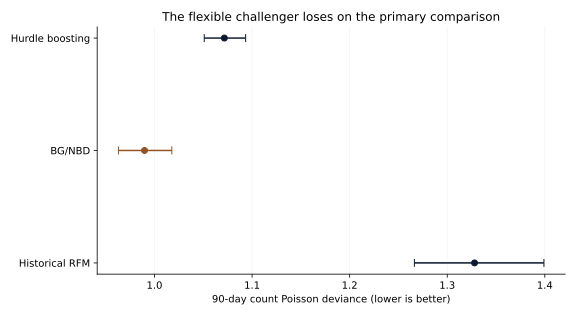
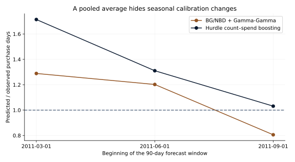

# S03 — When does a customer become worth winning back?

Run `S03-2f7d21cd-572e3627` · analysis `2f7d21cdbdd1255931a9297ca19303f3551e421e` · 2026-09-29.

## Decision and executive summary

A marketing leader needs to estimate which customers may return and how much an additional purchase would need to contribute before contact is worthwhile. In this historical retailer, **the BG/NBD purchase model outperforms the more flexible boosted challenger on the primary count-forecast score**. Its 90-day Poisson deviance is 0.990 versus 1.072. The challenger-minus-BG/NBD difference is **+0.082**, with 95% customer-bootstrap interval **0.068 to 0.096**. Lower is better. This is prediction error, not a percentage revenue gain.

The final comparison covers **14,388 customer-window forecasts, 5,155 distinct customers and 10,569 future purchase days**, across three 90-day periods in 2011. A purchase day combines a customer's positive purchases on one date. **36.9%** of those customer-windows contain a future purchase. BG/NBD estimates **37.9%**, while boosting estimates **49.0%**.

Keep the structured purchase model as the forecasting reference, but do not use its pooled calibration to promise campaign results. It predicts **5.5% more purchase days overall**, with marked seasonal reversals: **28.9% overprediction** for March-origin forecasts and **19.5% underprediction** for September-origin forecasts. No randomized campaign or observed permanent-churn label is available. A forecast that someone will buy is not evidence that contacting them causes a purchase.

## Implication for campaign economics

BG/NBD plus Gamma-Gamma predicts **£380.54 gross positive spend per 90-day customer-window**, against **£401.24 recorded**. Its implied predicted purchase-day value is **£490.83**. At an **assumed £1 contact cost and 30% contribution margin**, break-even requires **0.68 percentage points of incremental purchase probability**, assuming exactly one additional purchase day. This is an illustrative threshold, not measured lift, a response recommendation or expected ROI. Wholesale purchasing makes these values unsuitable as generic consumer-retail economics.

The explorer changes historical horizon, inactivity/frequency cohort and saved model. Cost £0–£5 and margin 10–50% change only the explicit scenario. Ordinary purchase probability must not be subtracted from the incremental threshold. Contribution is not observed, returns are excluded from the primary gross target, and channel/displacement costs are omitted.

## Evaluation evidence

| Model | Count deviance (95% interval) | Count MAE | Purchase Brier | Predicted / observed gross spend |
|---|---:|---:|---:|---:|
| Recent 90-day purchasing | 7.419 (7.098–7.732) | 0.584 | 0.226 | 0.867 |
| Historical RFM cohorts | 1.328 (1.266–1.399) | 0.831 | 0.187 | 1.485 |
| BG/NBD + Gamma-Gamma | 0.990 (0.963–1.018) | 0.621 | 0.170 | 0.948 |
| Hurdle count–spend boosting | 1.072 (1.051–1.093) | 0.698 | 0.190 | 1.227 |

The recent rule is omitted only from the plotted scale: its deviance is 7.419 and it remains in the table. It assigns zero expected purchases to inactive customers who sometimes return; log-based scoring floors means at 1e-8. It has the lowest absolute count error (0.584 versus BG/NBD 0.621), so the primary-score result does not mean BG/NBD wins every loss function. The recent rule's revenue MAE is £315.81 versus BG/NBD £321.84; probability calibration and count deviance are distinct objectives.

BG/NBD's predicted/observed count ratio is 1.055 (95% interval 1.029–1.082); boosting's is 1.303 (1.271–1.336). Gross-spend ratios are 0.948 (0.885–1.009) and 1.227 (1.127–1.327), respectively. Revenue uncertainty is wide: the top 1% of final customer-window spend accounts for **37.2%** of gross value, and the largest window is **£117,634.53**.

## Seasonal diagnostics and interval behavior

| Forecast origin | Model | Customers | Count ratio | Gross-spend ratio | Nominal 90% spend coverage |
|---|---|---:|---:|---:|---:|
| 2011-03-01 | BG/NBD + Gamma-Gamma | 4,410 | 1.289 | 1.275 | 97.9% |
| 2011-03-01 | Hurdle count–spend boosting | 4,410 | 1.714 | 1.729 | 96.1% |
| 2011-06-01 | BG/NBD + Gamma-Gamma | 4,823 | 1.202 | 1.096 | 98.1% |
| 2011-06-01 | Hurdle count–spend boosting | 4,823 | 1.310 | 1.150 | 92.0% |
| 2011-09-01 | BG/NBD + Gamma-Gamma | 5,155 | 0.805 | 0.676 | 93.1% |
| 2011-09-01 | Hurdle count–spend boosting | 5,155 | 1.031 | 0.996 | 87.8% |

The September window reverses the overall model ordering: count deviance is 1.043 for boosting versus 1.071 for BG/NBD. It remains part of the frozen pooled comparison. Earlier final outcomes enter later fits only after their observation horizons end; current-window outcomes never enter fitting or tuning.

BG/NBD's nominal 90% count intervals cover **97.8%** of final observations with average width **2.41 purchase days**; its spend intervals cover **96.2%** with average width **£1,237.62**. Boosting's count bands cover **98.4%**, width **2.82**, and spend bands cover **91.8%**, width **£984.34**. Wide/discrete intervals can overcover; the boosted spend coverage falls to **87.8%** in September. High pooled coverage is not proof of precise or stable prediction. These are predictive coverage rates, not confidence intervals for a cohort mean.

The explorer publishes 30/60/90-day recency-frequency cells only when at least 50 customer-window observations exist. It reports distinct customers as well as repeated windows. BG/NBD's 0/1/2/3/4/5+ distribution averages 2,000 predictive draws per observation. Its latent active probability is **91.3%** overall, distinct from the **37.9%** predicted chance of purchasing within 90 days. Basic BG/NBD fixes active probability at one for customers with no repeat purchases; that is a model limitation, not a known retention fact. The challenger and simple rules have no evaluated full count distribution and are not assigned one for display.

## Data and sensitivity

Chen, D. (2012), [Online Retail II](https://archive.ics.uci.edu/dataset/502/online+retail+ii), UCI, [doi:10.24432/C5CG6D](https://doi.org/10.24432/C5CG6D), [CC BY 4.0](https://creativecommons.org/licenses/by/4.0/). The UK non-store giftware retailer has many wholesale customers. Coverage is December 2009–December 2011, in nominal pounds. This analysis publishes original aggregates and code with source attribution, without publisher endorsement or raw customer records.

The workbook contains 1,067,371 rows and an overlapping month across its two sheets. Removing exact complete-row duplicates leaves 1,033,036 rows. There are 235,151 rows without customer ID; they cannot enter longitudinal forecasting. Positive-price, positive-quantity, noncancelled known-ID lines yield 779,425 lines, 36,969 invoices, 33,107 customer purchase days and 5,878 customers. Gross positive spend is £17,374,804.27. All credit/signed lines are accounted for separately, without pretending credits can be linked back to original purchases.

The multiset-union sensitivity preserves repeated within-sheet lines while removing overlapping sheet copies (1,044,848 rows). It refits all models with the frozen selected complexity. The challenger-minus-BG/NBD deviance difference remains positive: **0.094** (95% interval **0.080 to 0.109**). The accounting ambiguity does not reverse the primary comparison.

Final signed net spend is £5,550,737.62. Against this different outcome, the same gross forecasts have ratios 0.986 for BG/NBD and 1.276 for boosting. This is a target-mismatch sensitivity, not a net-spend model. Negative returns are not forced into a positive monetary likelihood. Actual customer acquisition and permanent dropout are unobserved; the first observed purchase only defines the analysis clock.

## Method, assumptions and reproducibility

Development snapshots begin March/June/September 2010. December 2010 validation customers are split by stable hash: one half selects seven versus fifteen boosted leaves on 90-day deviance, the other calibrates predictive bands. Seven leaves win validation (1.501 versus 1.532). Every final refit uses only completed historical labels, with validation-calibration rows excluded. Current as-of features include past purchasing/spend, age, inactivity, horizon and known calendar month; no ID, country or future outcome is a predictor.

BG/NBD population parameters fit the available purchase histories by multi-start maximum likelihood. Gamma-Gamma fits repeat purchase-day spend with q>1 for a finite mean; one-time buyers use the population mean. All three starts converge for each final fit with no parameter-bound hits. Repeat-frequency/spend Spearman correlations rise from 0.227 to 0.277 (Pearson 0.130–0.161), challenging strict independence. The spend model remains an assumption-based reference, not a verified joint process.

The boosted hurdle multiplies probability of any purchasing by one plus predicted excess count. A Gamma mean regression estimates purchase-day value, weighted by observed future purchase days. The construction preserves expected count ≥ probability of any purchase; a flexible mean fit does not establish Poisson or Gamma conditional variance.

BG/NBD expectations use a positive combined integral, valid when a≤1, checked with 64/128-node quadrature and independent simulation. Predictive intervals combine latent activity, heterogeneous rate/dropout and conditional Gamma-Gamma spend, conditional on fitted population parameters. The challenger uses separately calibrated finite-sample residual quantiles; seasonal drift, repeated customers and refitting prevent a guaranteed exchangeability claim.

The 1,000 paired bootstrap draws resample customers with all their final windows together. The 95% intervals condition on fitted models and observed historical seasons; they omit parameter-refitting uncertainty, unobserved future shocks and transport to other retailers. Only three nonoverlapping primary windows are available. Independent technical review is pending.

Method references: [Fader, Hardie & Lee, BG/NBD derivation (2019)](https://brucehardie.com/notes/039/); [Schumacher, Fader & Hardie, expectation correction (2022)](https://www.brucehardie.com/notes/041/); [Fader & Hardie, Gamma-Gamma model (2013)](https://www.brucehardie.com/notes/025/). No source implementation is copied.

Run `uv sync --frozen`, `uv run python -W error studies/S03/study.py`, then `uv run python scripts/report_s03.py`. [PROTOCOL.md](PROTOCOL.md), [DATA.md](DATA.md), locked dependencies and [results/result.json](results/result.json) record exact inputs, code version and comparisons. Set `RESEARCH_DATA_DIR` outside the checkout. Raw records and customer-level verification arrays remain private.
