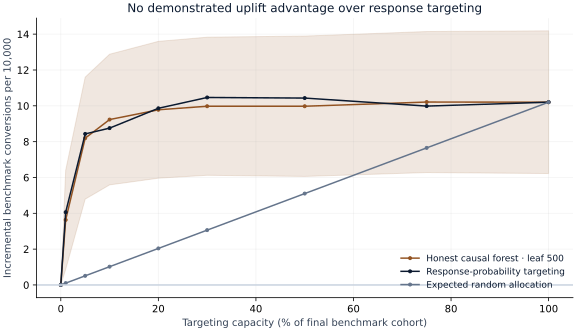
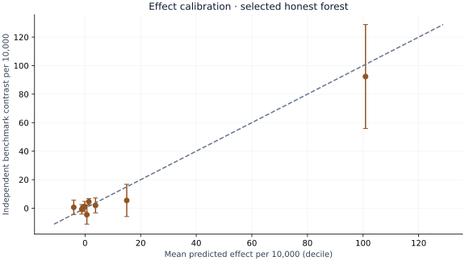

# S04 — Advertising incrementality evaluation

Run `S04-36e06a94-2716e1bf` · analysis commit `36e06a9402b561bcf051e186c11ae9aeabf8aa42` · 2026-09-29.

## Decision and executive summary

Do not replace response targeting solely because a method is designed to estimate uplift. At the prespecified 20% capacity, the honest causal forest selected on validation estimates **9.78 incremental benchmark conversions per 10,000 eligible records**, versus **9.86** for response targeting. The paired difference is **-0.08**, with a 95% interval of **-0.89 to 0.73**. This test does not demonstrate an advantage for the uplift upgrade, and it does not prove exact equality.

Both targeted policies outperform expected random allocation in point estimates, but the main decision is whether the more complex targeting system improves on the existing alternative. Validate a change in a current randomized setting with known costs, rather than presenting this benchmark as advertiser ROI.

## Evidence

| Policy at 20% capacity | Benchmark conversions per 10,000 | 95% interval |
|---|---:|---:|
| Doubly robust learner · L2 10 | 9.54 | 5.88 to 13.21 |
| Doubly robust learner · L2 100 | 9.66 | 6.02 to 13.30 |
| Honest causal forest · leaf 100 | 9.50 | 5.70 to 13.29 |
| Honest causal forest · leaf 500 · selected in validation | 9.78 | 5.96 to 13.60 |
| Response-probability targeting | 9.86 | 6.06 to 13.67 |
| Expected random allocation | 2.04 | 1.24 to 2.84 |

All four advanced candidates remain visible. Selection used validation only; the selected forest has minimum leaf size 500. Final evaluation contains 398,506 records, 352,598 distinct feature profiles and 1,243 conversions. There are 60,018 control records with 127 conversions and 338,488 treatment-assigned records with 1,116 conversions. Labels are rare, especially in control, so capacity-specific contrasts are uncertain.

Treat-none is the zero endpoint. Treat-all estimates 10.20 benchmark conversions per 10,000 relative to none (95% interval 6.22–14.19). Random allocation is an analytical expected policy; its selected count and event counts are expected, not observed random draws. Policies are scored using independent final outcomes, not the sum of their own predicted effects.

## Source and assignment audit

The corrected v2.1 source has 13,979,592 rows and twelve features f0–f11. An outcome-independent hash sample keeps 1,995,142 records. Matching profiles cannot cross split boundaries. Model fitting uses 596,910 development records; validation uses 399,506. Additional development rows are excluded by a fixed profile-hash rule to bound fitting cost. No chronological split or independent person identifiers are invented.

Treatment propensity in final records ranges from 0.773 to 0.895; no score hits the [.05,.95] clipping boundary. Assignment-prediction AUROC is 0.509. Near-chance discrimination is a balance diagnostic, not proof that privacy sampling preserved causal exchangeability. Realized exposure and both outcome fields are excluded from predictors.

The publisher non-uniformly subsampled data for privacy. Causal interpretation requires assumptions within that released benchmark, and original advertiser incrementality/economics cannot be recovered. No actual campaign cost, future market effect or fairness conclusion is observed.

## Sensitivity and calibration

| Selected policy sensitivity | Selected share | Contrast per 10,000 | 95% interval |
|---|---:|---:|---:|
| learned_propensity_DR | 20.0% | 9.78 | 5.96 to 13.60 |
| constant_propensity_DR | 20.0% | 10.20 | 6.54 to 13.86 |
| learned_propensity_IPW | 20.0% | 10.08 | 5.91 to 14.26 |
| one_record_per_profile | 22.5% | 11.24 | 6.94 to 15.54 |

The one-record-per-profile sensitivity retains the frozen policy selections; the resulting selected share changes and is shown explicitly. It changes the evaluation population and is not a same-capacity comparison. Complete decile effect calibration, feature balance and all model sensitivities are in the result JSON.

Confidence intervals use profile-cluster influence sums and a finite-cluster correction. They condition on fitted models and rankings, do not adjust for unknown campaign dependence, and are not simultaneous guarantees across the plotted capacities. The primary paired comparison was fixed at 20% before final scoring. Sampling bias and causal-identification uncertainty are outside these statistical intervals.

## Economic scenarios

The web controls multiply independent benchmark conversions per 10,000 by an assumed value ($0–$1,000) and subtract selected fraction×10,000×assumed contact cost ($0–$10). The displayed interval rescales the held-out contrast interval under fixed assumed prices. It is not profit, advertiser ROI or a new experiment. Moving controls does not change measured policy evidence.

## Reproduction and attribution

See [README.md](README.md), [PROTOCOL.md](PROTOCOL.md) and [DATA.md](DATA.md). The result records the source checksum, exact code version, locked package versions, cross-fitting counts, tuning scores and all comparison tables. Individual records/predictions remain external. Independent technical review is pending.

Source: Diemert, E., Betlei, A., Renaudin, C. & Amini, M.-R. (2018), *A Large Scale Benchmark for Uplift Modeling*, AdKDD/TargetAd Workshop. [Corrected Criteo dataset](https://ailab.criteo.com/criteo-uplift-prediction-dataset/). Derived aggregate research tables: [CC BY-NC-SA 4.0](https://creativecommons.org/licenses/by-nc-sa/4.0/), with no warranty. Original analysis code is separate; raw data are not redistributed.
