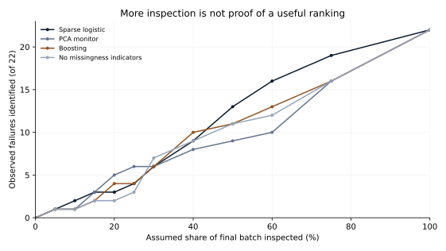
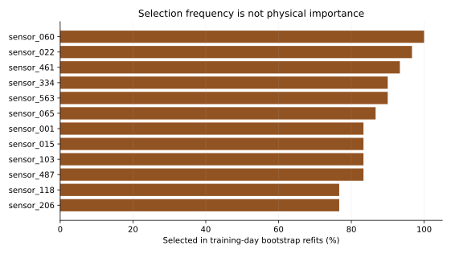

# S13 — Reliable quality screening with many sensors and few failures

Run `S13-608719b7-eea568ba` · analysis `608719b77b23e68f298f456d69b725aba42a8d16` · 2026-09-29.

## Decision and executive summary

Do not use this comparison to justify automatic release or reduced quality inspection. On 359 later production entities, the tested models provide weak ranking evidence. At 20% capacity (71 inspections), boosting identifies only 4 of 22 observed failures; sparse logistic identifies 3 and the PCA monitor 5. Most failures remain undetected under that assumed budget.

Boosting's average precision is 0.0626, versus 0.0765 for sparse logistic and a 0.0613 final failure prevalence. The primary paired difference is **-0.0140** (95% day-cluster interval **-0.0963 to +0.0212**). No clear advantage is established. Average precision summarizes precision over recall thresholds; higher is better, but its numerical value depends on failure prevalence. It is not an accuracy percentage or the detection rate at 20% capacity.

The decision implication is to require prospective evidence and verified feature timing before operational use. The data contain anonymous sensors without acquisition timestamps. This is a historical screening comparison conditional on recorded measurements being available; it does not establish advance warning, root causes, avoided failures or savings.

## Final evidence

| Model | Average precision | 95% interval | Log loss | Brier score |
|---|---:|---:|---:|---:|
| Sparse elastic-net logistic | 0.0765 | 0.0345–0.1748 | 0.2550 | 0.0602 |
| PCA process monitor | 0.0660 | 0.0318–0.1335 | 0.2358 | 0.0585 |
| Gradient boosting | 0.0626 | 0.0317–0.0993 | 0.2586 | 0.0594 |
| Boosting without missingness indicators | 0.0632 | 0.0312–0.1020 | 0.2586 | 0.0594 |
| Training failure prevalence | 0.0613 | 0.0252–0.0977 | 0.2308 | 0.0576 |

A constant training-prevalence probability has lower final log loss and Brier score than the fitted sensor models. Probability calibration therefore does not support treating their scores as dependable failure probabilities. The result artifact includes five equal-count calibration groups and day-specific diagnostics.

| Model at 20% capacity | Inspections | Detected failures | Missed failures | Inspected passes |
|---|---:|---:|---:|---:|
| Sparse elastic-net logistic | 71 | 3 | 19 | 68 |
| PCA process monitor | 71 | 5 | 17 | 66 |
| Gradient boosting | 71 | 4 | 18 | 67 |
| Boosting without missingness indicators | 71 | 2 | 20 | 69 |

These are exact counts from one historical holdout, not expected counts in a new plant. Capacity ranks the complete October batch, not a daily production schedule. Inspecting all units recovers all known labels by construction; it is not a measured process improvement.

## Data, timing and selection

SECOM contains 1,567 production entities and 104 failed tests from July 19–October 17, 2008. The official documentation lists 591 features; the actual numeric file has 590 sensor columns. The separate label file aligns row-for-row and contains quoted test timestamps. Source audit: 41,951 missing cells, 116 constant columns, 104 exact duplicate columns, no exact duplicate full sensor rows and 33 timestamp ties.

July–August supplies 618 development rows and 65 failures. September supplies 590 validation rows and 17 failures. October supplies the untouched final 359 rows and 22 failures. Separate family settings are selected by September log loss; final fitting uses 1,208 July–September rows and 82 failures. The chosen settings are elastic-net C=.1, PCA five components, and boosting seven leaves. September boosting average precision was 0.2519; that performance did not persist in October. No tuning uses final outcomes.

All filtering, clipping, imputation, duplicate removal, scaling and missingness-indicator selection are fitted inside the permitted training period. No timestamp enters a predictor. Reporting delay, wafer/lot grouping and the acquisition time of each measurement are not available, so calendar order alone cannot reconstruct a prospective deployment.

## Sparse-sensor stability and missingness

The final processor retains 444 original sensors and 502 transformed variables. Sparse logistic retains 79 nonzero coefficients representing 78 sensors. Across 30 training-day bootstrap refits, 72–129 sensors are selected, with mean Jaccard overlap **32.5%** against the final selected set. This substantial variability is a warning against interpreting a single selected list as a durable engineering diagnosis.

Sensor_060 is selected in every resample, but the source supplies no physical identity or intervention evidence. Selection frequency describes this estimator and dataset, not a causal fault. The explorer can change its display threshold without refitting any model.

Removing missingness indicators from the selected boosting configuration leaves average precision near 0.0632 and finds only two failures at 20% capacity. This is a fixed sensitivity analysis, not a separate model search. Forty-eight final entities have more than 5% of sensors missing and no observed failures; that slice cannot establish failure-detection quality.

## Uncertainty and limitations

The primary uncertainty uses 1,000 paired calendar-day cluster draws; all contain both outcomes. Only 17 final days and 22 failures are available. A two-day circular-block sensitivity gives -0.0676 to +0.0145, also inconclusive. Intervals condition on the fitted models and recorded period; hidden production batches and future drift remain unresolved. Sensor stability uses a separate 30-resample training procedure.

A development-only optimizer check corrected the degenerate all-zero coefficient case to its analytical training-prevalence intercept. This correction was committed before final results were inspected; it did not change the chosen C=.1 model. No failure labels or held-out metrics were changed. The protocol and tests record that numerical safeguard.

This short, historical, anonymous dataset is not evidence for a modern manufacturing deployment. No human engineering diagnosis or independent technical review is claimed; independent review remains pending.

## Reproduce and cite

Run `uv sync --frozen`, `uv run python -W error studies/S13/study.py`, then `uv run python scripts/report_s13.py`. [PROTOCOL.md](PROTOCOL.md), [DATA.md](DATA.md) and [results/result.json](results/result.json) contain the frozen design, hashes, all model comparisons and aggregate diagnostics. Individual measurements and predictions remain outside publication.

McCann, M. & Johnston, A. (2008). [SECOM](https://archive.ics.uci.edu/dataset/179/secom), UCI Machine Learning Repository, [doi:10.24432/C54305](https://doi.org/10.24432/C54305). Source data: [CC BY 4.0](https://creativecommons.org/licenses/by/4.0/). This study transforms the source into original aggregate analyses; no publisher endorsement is implied.
