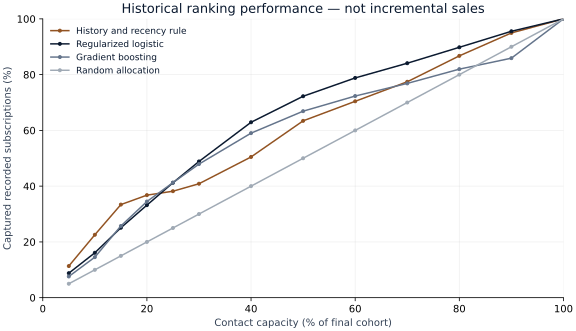
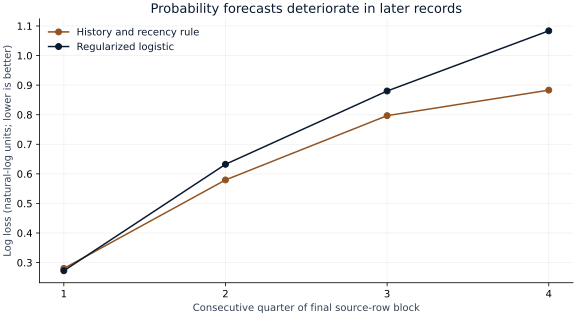

# S28 — Evaluation report

Run `S28-da76dd82-74adfc57` · analysis commit `da76dd823b1b242cd90fc0280f93926d2bd575ba` · 2026-09-29.

## Decision and executive finding

For limited contact capacity, keep a simple history-and-recency ranking as the benchmark before deploying a more complex response model. It identifies 934 recorded subscriptions among 1,647 selected contacts (56.7%), versus 843 (51.2%) for the logistic model chosen on earlier development records. Random allocation has an analytical expectation of 507.8 subscriptions at the same capacity.

The predeclared primary metric also favors the simple rule: logistic-minus-rule log loss is **0.0822 natural-log units** (95% block-bootstrap interval **0.0470–0.1177**; lower loss is better). This is a negative finding for the proposed model upgrade. It does not show that contacting customers causes these subscriptions, and does not justify a production targeting rule without current validation and appropriate review.

## Evidence

| Model | Log loss ↓ | Brier ↓ | AUROC ↑ | Responses at 20% | Precision (95% interval) |
|---|---:|---:|---:|---:|---:|
| Random allocation | 0.7423 | 0.2488 | 0.5000 | 507.8 | 30.8% (26.9%–34.8%) |
| History and recency rule | 0.6349 | 0.2095 | 0.6724 | 934.0 | 56.7% (48.7%–65.1%) |
| Regularized logistic | 0.7171 | 0.2362 | 0.6923 | 843.0 | 51.2% (46.1%–56.2%) |
| Additive spline logistic | 0.7536 | 0.2502 | 0.5734 | 790.0 | 48.0% (43.1%–52.7%) |
| Gradient boosting | 0.7448 | 0.2414 | 0.6328 | 876.0 | 53.2% (48.3%–58.3%) |
| Boosting with richer attributes | 0.7284 | 0.2397 | 0.6800 | 831.0 | 50.5% (45.8%–54.7%) |

All model families are shown. The principal logistic family was chosen by development-fold log loss, before final holdout scoring. Expanded-feature boosting is a sensitivity analysis, not a second opportunity to select the final model. Random responses are expected, not observed selected counts. Ranking for the business rule uses its declared score; its proper-score metrics use separately calibrated probabilities.

## Data and evaluation population

UCI Bank Marketing, bank-additional-full: 41,188 source-ordered records, May 2008–November 2010. Development 28,831 (1,606 positive); calibration 4,119 (494 positive); final holdout 8,238 (2,540 positive). Outcome prevalence rises from 5.6% in development to 30.8% in evaluation. The file has no exact dates or stable customer IDs. A record is not necessarily an independent person.

There are 12 exact repeated rows, two held-out profiles matching earlier profiles when duration/outcome are omitted, and 570 held-out records whose month was unseen in development. Missing categorical values remain explicit unknown levels; default status is unknown in 8,597 records. Full missingness, category novelty and overlap sensitivity are in the JSON. No identity is inferred from matching anonymized fields.

## Failure analysis and sensitivity

Logistic log loss rises from 0.2725 in the first final-test quarter to 1.0836 in the fourth; the rule rises from 0.2803 to 0.8831. Final-quarter subscription prevalence is much higher than in model development. Earlier calibration does not protect against this shift. Subperiods are consecutive source-row groups, not claimed calendar quarters.

Changing bootstrap block size from 100 to 50 or 200 leaves the primary interval above zero. Dropping the two previously seen profiles does not reverse the main comparison. Adding demographics and loan/default attributes to boosting does not beat the simple rule on final log loss or at the specified 20% capacity. Such attributes are excluded from the primary ranking.

The 500-draw paired circular block bootstrap preserves short-range row dependence. Its intervals describe repeated sampling conditional on fitted models; they omit retraining uncertainty, cannot identify repeated customers, and do not measure causal effects. At a fixed capacity, bootstrap precision/capture resamples the frozen selected indicators; bootstrap selected counts may vary. It is not a confidence interval for the already observed finite-test count.

## Scenario interpretation

The interactive arithmetic is `assumed response value × observed selected subscriptions − assumed contact cost × selected contacts`. The supported inputs are $0–$1,000 assumed value and $0–$50 assumed cost, in hypothetical USD-equivalent units. These are not observed bank financials, profit, treatment effects or predicted future revenue. A scenario interval rescales the conditional precision interval at fixed selected count; it is not an interval for causal profit. Break-even value is assumed cost divided by observed response precision.

## Reproduction and boundaries

Run the commands in [README.md](README.md). [PROTOCOL.md](PROTOCOL.md) fixes splits, feature timing, candidate grids, selection and uncertainty. [DATA.md](DATA.md) records provenance and attribution. `results/result.json` contains all model scores, uncertainty, calibration bins, capacity points, period results, tuning scores and source/data hashes. This report and its SVG figures are regenerated by `scripts/report_s28.py`.

The NumPy correction changes two rounded supplementary outputs by 0.00000001; the primary estimates, counts and conclusion are unchanged. No evaluation design or grid was altered after viewing the holdout. Independent technical review is pending. The historical observed-contact cohort cannot establish causal gains, current bank performance, equal opportunity across groups or legal suitability of a targeting deployment.
