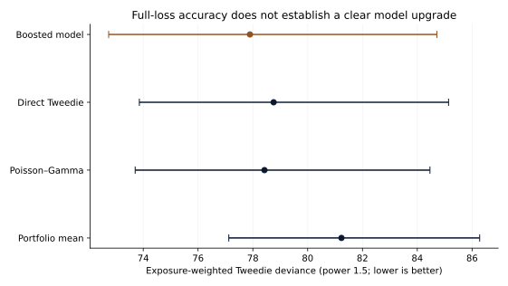
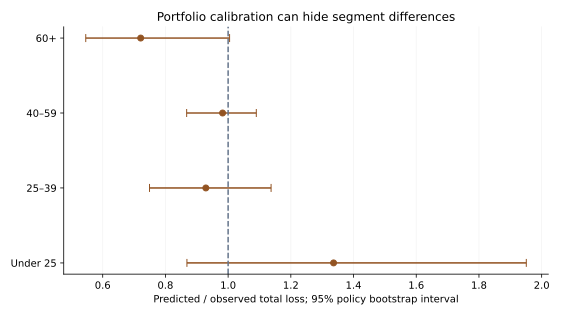

# S31 — Insurance pricing: interpretable structure versus nonlinear accuracy

Run `S31-02c309de-1e141502` · analysis `02c309de271f6bb119a598b0c5972a3a697e553b` · 2026-09-29.

## Decision and executive summary

An insurance analytics leader needs an expected-loss model that improves decisions and remains calibrated across the portfolio. This evaluation **does not establish a clear full-loss accuracy advantage** for the boosted challenger over interpretable frequency–severity regression. On 136,271 held-out policies and 5,426 claims, the primary deviance is 77.894 versus 78.424. The paired difference is **-0.531**, with 95% interval **-1.626 to +0.811**. Lower is better; this is a prediction-error measure, not a percentage saving.

The full-loss portfolio records **€147.76 per policy-year**. Boosting predicts **€138.35**, about 6.4% below that recorded average; the interpretable model predicts **€158.74**, about 7.4% above it. Uncertainty includes exact calibration for both models. An expense loading cannot repair a biased or unstable expected-loss estimate.

Keep the interpretable comparator and require tail and segment evidence before replacement. The largest 1% of source claims account for 38.0% of recorded loss. Better performance after limiting claim size does not establish dependable full-tail pricing. These are historical model comparisons, not current quotes, regulatory filings or realized savings.

## Evidence from the untouched policy holdout

| Model | Tweedie deviance | 95% interval | Estimated €/policy-year | Predicted / observed total loss |
|---|---:|---:|---:|---:|
| Training portfolio mean | 81.233 | 77.122–86.277 | €172.00 | 1.164 |
| Poisson–Gamma regression | 78.424 | 73.706–84.463 | €158.74 | 1.074 |
| Direct Tweedie regression | 78.759 | 73.859–85.142 | €167.63 | 1.135 |
| Boosted frequency–severity | 77.894 | 72.738–84.717 | €138.35 | 0.936 |

Deviance uses fixed power 1.5 and exposure weights. It compares mean predictions while respecting unequal exposure. The result includes exposure-weighted absolute error, portfolio calibration, ten risk-group calibration tables and frequency/severity decomposition. Direct Tweedie estimates pure premium directly and has no fitted frequency/severity components. The constant training-portfolio reference is also reported, rather than omitted after comparison with fitted models.

Boosting predicts 7.33 claims per 100 policy-years and €1,886.53 per predicted claim, versus 7.52 observed claims and €1,965.01 observed average severity. Cohort-level predicted severity is weighted by predicted event frequency so the decomposition exactly reconstructs expected total loss. It is not an unweighted average of policy severities.

## Segments, tail sensitivity and geographic transfer

For the 60+ driver cohort, boosting's predicted/observed full-loss ratio is 0.721 (95% interval 0.546–1.005), based on 22,637 final policies and 887 claims. Area F has ratio 0.604 (0.315–1.311) on 3,628 policies and 150 claims. These descriptive slices show wide uncertainty; they are neither causal effects nor a fairness certification. Region, Area and age cohorts require at least 500 final policies. Small suppressed regions remain in portfolio totals.

The separately fitted **€50,000 per-claim sensitivity** has final boosting deviance 71.304 versus 72.025 for the interpretable model, difference **-0.721** (95% interval **-1.111 to -0.317**). It uses settings selected on uncapped development outcomes, without retuning. Capped observed loss is €130.75 per policy-year; boosting predicts €123.93. This is a different target, not an actual policy limit or evidence that large claims disappear.

All **69,789 Ile-de-France policies** and 2,591 claims are reserved for a separate geographic stress test. Both models omit Region and train on 485,915 non-reserved development/validation policies. Their settings are selected only on non-reserved development/validation; no reserved-region outcomes enter fitting or selection.

| Geographic-stress model | Tweedie deviance | Predicted / observed loss |
|---|---:|---:|
| Poisson–Gamma regression | 83.010 | 1.842 |
| Boosted frequency–severity | 78.443 | 1.191 |

The stress-test difference is **-4.567** (95% interval **-6.017 to -2.791**), favoring boosting. Nevertheless, boosting overpredicts reserved-region loss by 19.1% (95% ratio interval 1.045–1.374). A better relative score does not mean absolute calibration. This is a different population and model specification, not a substitute for the primary test or future-time evidence.

## Data audit and estimation

The archived CASdatasets 1.2-0 files contain 677,991 policies and 26,444 claims, approximately 2011–2013. Exposure totals 358,482.835463 policy-years; nominal claim loss totals €59,909,216.50. Every claim matches a policy and every policy's severity-row count equals ClaimNb. There are no missing fields. Keep all 235 repeated severity rows because identical settlement amounts can be distinct claims. Keep 1,224 exposures above one year, up to 2.01. The maximum claim is €4,075,400.56; 88 claims exceed €50,000 and together account for €17,917,329.27. The single largest claim is 6.8% of source loss.

The salted SHA-256 policy split supplies 405,817 development policies, 135,903 validation policies and 136,271 final policies. Final fitting uses 541,720 development/validation policies. ID factor labels, not internal R factor codes, join the files and determine allocation. No reliable policy dates exist; no temporal validation is claimed. Source risk-field timing and ultimate claim maturity remain unverified.

Poisson frequency uses count/exposure with exposure weights, equivalent to a count likelihood with log-exposure offset. Gamma severity uses policy-average claim amount with claim-count weights, equivalent parameter estimation to repeated claim rows with shared predictors. Cubic age splines, transformed density/bonus-malus and one-hot risk categories are fitted in permitted training data. Direct Tweedie uses the same feature structure. Boosting uses numerical ages/transforms and categorical splits. All models exclude ID, claims, loss and exposure as predictors.

Validation selects alpha .0001 for both regression families and seven leaves for boosting. The frozen alternative settings remain in the tuning table. No final calibration or additional hyperparameter search is performed. Mean squared Pearson count residuals are 1.778 for Poisson regression and 1.741 for boosting, indicating residual overdispersion relative to the Poisson variance assumption. Mean estimation and empirical policy bootstrap are used; no Poisson claim-count prediction intervals are claimed.

## Uncertainty, interaction and limits

The primary and geographic comparisons use 500 paired policy bootstrap draws; each segment uses 250 draws. Different Monte Carlo samples can yield slightly different portfolio-ratio intervals in the metrics and segment tables. They estimate uncertainty conditional on fitted models and the empirical tail. Repeated policyholders, common shocks, claim development, future inflation and unseen catastrophes are not resolved. There is no independent temporal replication.

The website explorer switches saved model, cohort and full/capped outcomes. A separate assumed expense loading, 0–50%, calculates pure premium/(1−loading). The default full-loss boosted estimate at 20% loading is €172.93 per policy-year. Loading is not estimated from data, and profit, taxes, capital, reinsurance and regulatory constraints are omitted. Controls never refit models or change held-out accuracy.

Independent technical review is pending. No individual insurance decisions are taken. Historical French claims do not validate a current rate filing, fairness assessment or causal explanation.

## Reproduce and cite

Run `uv sync --frozen`, `uv run python -W error studies/S31/study.py`, then `uv run python scripts/report_s31.py`. [PROTOCOL.md](PROTOCOL.md), [DATA.md](DATA.md) and [results/result.json](results/result.json) record the frozen design, exact archived inputs, checksums and all aggregate comparisons. Source policy data and individual predictions remain outside publication.

Dutang, C.; Charpentier, A.; Gallic, E. [Insurance dataset](https://doi.org/10.57745/P0KHAG), Recherche Data Gouv, version 1.1, July 12, 2024; CASdatasets 1.2-0, file [doi:10.57745/ULR0ZA](https://doi.org/10.57745/ULR0ZA). [Publisher dictionary](https://dutangc.github.io/CASdatasets/reference/freMTPL.html). Dataset metadata: Etalab Open Licence 2.0. Package code: GPL >=2. This study publishes original analysis and aggregates with source attribution; no publisher endorsement is implied.
