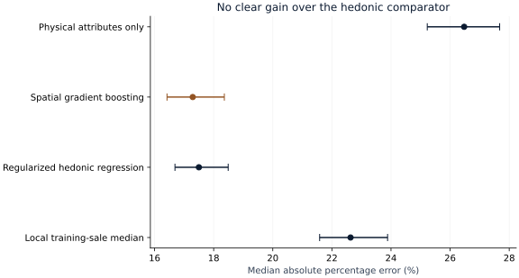
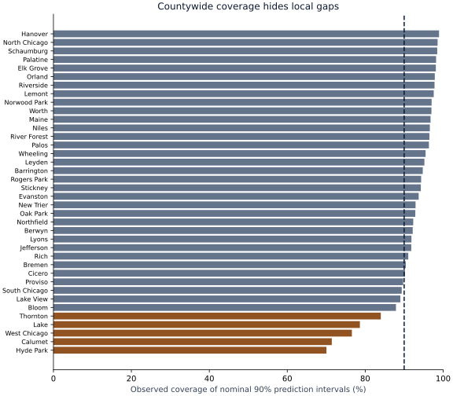

# S43 — Chicago-area property valuation with honest geographic uncertainty

Run `S43-a92f1ea2-98e410fd` · analysis commit `a92f1ea2f8e5f77ebb10775722577f8f98162307` · 2026-09-29.

## Decision and executive summary

Do not choose a property-value model by its countywide score alone. On **24,551 later sale records**, spatial boosting has **17.29% median percentage error**, compared with **17.50%** for a regularized hedonic model. The primary paired difference is **-0.21 percentage points** (95% interval **-0.53 to +0.18**). This does not establish a clear advantage over the simpler regression.

Location matters: removing location from the boosted model raises error to **26.48%**. But flexible location features do not solve local uncertainty. The nominal 90% intervals cover **89.8%** countywide yet only **70.1%** in the historical Hyde Park township cohort. That township is an assessment geography, not the smaller neighborhood commonly called Hyde Park. A near-target county average is not a reliable assurance for every local market.

A leader should require local interval audits and a route for cases outside the studied property scope. The site shows historical cohort distributions and measured local errors; it does not offer a current appraisal, an individual tax-appeal recommendation or an exact price quote.

## Evidence

| Model | Median percentage error | 95% interval | Log-price RMSE | Median absolute error |
|---|---:|---:|---:|---:|
| Local training-sale median | 22.63% | 21.59–23.88% | 0.417 | $75,996 |
| Regularized hedonic regression | 17.50% | 16.69–18.49% | 0.340 | $60,983 |
| Spatial gradient boosting | 17.29% | 16.42–18.36% | 0.337 | $60,996 |
| Physical attributes only | 26.48% | 25.23–27.68% | 0.488 | $95,420 |

The final cohort contains 23,898 parcels in 331 spatial cells. The 500 paired .03-degree spatial-cluster bootstrap draws keep every repeat sale from a parcel together. Both principal models tend to underpredict: median predicted-to-observed ratios are about 0.93. Dollar error is virtually identical for the two models. All intervals condition on the fitted models and this historical sample.

## Data and information timing

The characteristics snapshot was last modified April 10, 2024 and describes 2023 property records. Every included sale occurs later, from May 2024 onward. Development has 16,519 May–October sales; validation has 4,327 November–December sales. Final fitting uses 20,846 May–December 2024 sales. January–March 2025 supplies 5,828 distinct calibration parcels. Final evaluation uses April–December 2025 sales. No closing date or later property update enters a predictor.

The original snapshot has 1,098,988 card rows; single-family, single-card, single-land-line and non-prorated restrictions yield 878,069 unique parcels. The sales source contains 132,773 records. Publisher multi-parcel/deed/duplicate/low-price flags exclude 34,637; 45,918 remaining sales do not match the eligible snapshot. Predetermined price/area bounds remove 953 more. The result artifact preserves each sequential exclusion, zero missing projected sale fields and full join checks.

Sales are drawn from a September 2026 corrected extract. Historical ingestion timestamps are unavailable, so chronological sale dates do not prove the same records were available in real time. Features are demonstrably pre-sale; label availability is a separate limitation. Buyer/seller names were never requested in the projected sales download. Raw addresses, PINs and precise property coordinates remain outside publication.

## Geographic uncertainty

| Township | Final sales | Median percentage error | 90% interval coverage |
|---|---:|---:|---:|
| Hyde Park | 1,309 | 35.7% | 70.1% |
| Calumet | 84 | 34.7% | 71.4% |
| West Chicago | 773 | 26.4% | 76.6% |
| Lake | 2,879 | 27.4% | 78.6% |
| Thornton | 1,313 | 24.0% | 84.0% |

These are diagnostic groups, not newly selected primary hypotheses. Cells with fewer than 30 sales are withheld. Nominal 80%,90%,95% bands use a separate finite-sample log-residual calibration order statistic. Temporal drift, spatial dependence and repeated parcels violate simple exchangeability assumptions, so empirical local coverage remains visible rather than a guaranteed probability for a particular house.

Countywide median 90% interval width is about $384,244 for spatial boosting. This is a wide band around heterogeneous historical sale predictions. The explorer's median lower/upper bounds summarize individual bands; they are not confidence bounds for the township's mean or median value.

## Stress tests and assessment benchmark

The spatial transfer check reserves 60 final grid cells and removes all fitting, tuning and calibration rows from those cells. On 5,064 final sales, spatial boosting has 18.68% median percentage error and 88.9% interval coverage, versus 19.24% and 86.6% for the hedonic comparator. This uses a separately tuned non-reserved development cohort and remains a supplementary comparison.

The previously unseen-parcel slice contains 22,938 sale records: no parcel appeared in fitting or calibration. Spatial boosting error is 16.46% and 90% coverage 90.8%. That slice has a different population from the primary cohort; it does not substitute for the main result after seeing performance.

The frozen prior-year board assessment, multiplied by 10 under the residential assessment convention, is available for 24,498 final sales; 53 are missing/nonpositive. It has 35.09% median percentage error on that available-case subset. Older assessed values are not ground truth or current appraisals, and this result is not an assessment-office performance review.

## Method, reproducibility and attribution

The simple comparator pools training neighborhood medians with township/global fallbacks. The hedonic model uses Ridge(alpha=10) with training-only numeric imputation/scaling and categorical encoding. The spatial challenger selects 31 versus 15 leaves using validation only; 250 iterations, learning rate .05 and L2=10 are fixed. A physical-only ablation removes coordinates and township. See [PROTOCOL.md](PROTOCOL.md), [DATA.md](DATA.md), [README.md](README.md) and [result.json](results/result.json).

Source: Cook County Assessor's Office, [public input files](https://github.com/ccao-data/model-res-avm#Getting-Data) and [Parcel Sales](https://datacatalog.cookcountyil.gov/d/wvhk-k5uv). The [County terms](https://www.cookcountyil.gov/terms-use) disclaim accuracy/completeness warranties and endorsement; no separate Creative Commons license is invented. No County graphics or raw records are redistributed. Source hashes, queries and versions are preserved. Independent technical review remains pending.

Recreate the figures and report with `uv run python scripts/report_s43.py`. The analysis uses a fixed historical snapshot; updated API records can fail checksum verification and must not silently replace the pinned input.
