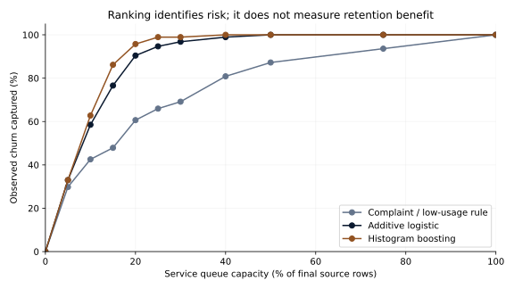
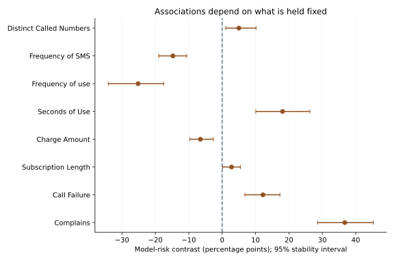
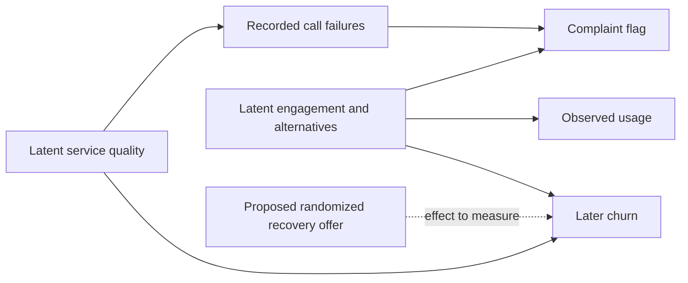

# S47 — Service-friction signals and a three-month churn planning window

Run `S47-a0ada992-696c3a18` · analysis `a0ada99288b53cae3fd494991e16e055c7c5c39a` · 2026-09-29.

## Decision and executive summary

A telecom service leader wants an early-warning queue that identifies customers at risk before deciding how to help them. In this small historical sample, **boosting improves forecast quality over additive regression even after excluding the uncertain status and calculated-value fields**. Final calibrated log loss is **0.0981 versus 0.1576**; lower is better. The paired difference is **-0.0595**, with 95% profile-bootstrap interval **-0.0826 to -0.0347**. This is predictive error, not a retention gain.

At 20% capacity, the service queue contains **124 of 624 final records**. Boosting identifies **90 of 94 observed churn outcomes** (95.7% recall, 95% interval 89.9–100.0%), versus **85** for additive regression and **57** for the complaint/low-usage rule. The boosted queue also contains **34 records that did not churn**, and misses **4 that did**. None of the 90 outcomes is claimed prevented.

Retain the service-friction fields for further prospective testing: dropping complaints and call failures worsens boosted log loss by **0.0511** (95% interval **0.0255–0.0774**). Adding Status or calculated Customer Value does not establish a clear further improvement. A larger score is not permission to use an inadequately timed field operationally.

Before using these rankings in a live service program, validate field timing and record identity on a later cohort, then randomize an actual recovery intervention. The file has **no customer ID or dates**, includes repeated and contradictory profiles, and comes from one company with an unspecified collection year. The documented planning gap cannot become a genuine out-of-time validation without additional data.

## Primary evidence and service capacity

The final partition contains **624 rows, 561 distinct primary-feature profiles and 94 churn labels** (15.1%). Identical primary profiles stay together in every partition and cross-validation fold. Rows are not represented as verified independent customers.

| Model | Log loss (95% interval) | Average precision | Churn in 124 contacts | Recall 95% interval |
|---|---:|---:|---:|---:|
| Development prevalence | 0.4241 (0.3723–0.4779) | 0.1506 | 19 / 94 | 13.4–28.4% |
| Complaint / low-usage rule | 0.3011 (0.2493–0.3502) | 0.5063 | 57 / 94 | 50.5–69.0% |
| Ridge logistic | 0.2023 (0.1624–0.2424) | 0.7844 | 74 / 94 | 70.5–91.1% |
| Additive logistic | 0.1576 (0.1245–0.1936) | 0.8622 | 85 / 94 | 80.3–96.6% |
| Histogram boosting | 0.0981 (0.0703–0.1333) | 0.9490 | 90 / 94 | 89.9–100.0% |

The default boosted queue has 72.6% precision. Average precision is 0.949 (95% interval 0.906–0.974) versus additive 0.862 (0.792–0.923); chance prevalence is 0.151. The primary log-loss comparison is prespecified. Precision/recall are budget-specific descriptive outcomes, not estimated effects of making contact. Capacity ties use an outcome-independent hash of original row index. The prevalence reference uses that deterministic tie order; it is not a learned ranking.

## Feature sensitivity and probability calibration

Every variant keeps the same profile partitions and independently selects its model setting within development. Calibration always uses the separate calibration partition. Derived-field comparisons are sensitivities, not a revised primary model selected from the final result.

| Boosted feature variant | Log loss | Difference from core | 95% paired interval |
|---|---:|---:|---:|
| no_friction | 0.1492 | +0.0511 | +0.0255 to +0.0774 |
| with_status | 0.0899 | -0.0082 | -0.0218 to +0.0044 |
| with_value | 0.0999 | +0.0018 | -0.0053 to +0.0093 |
| with_both | 0.0939 | -0.0042 | -0.0177 to +0.0086 |

`core` has ten documented fields, excluding Status, Customer Value and redundant Age. `no_friction` additionally removes Complains and Call Failure. The other variants add Status, Customer Value or both. Value is calculated with an unspecified operational formula and is not verified profit. The publisher describes all predictors as first-nine-month summaries, but no source timestamps independently verify that assertion.

Probability recalibration is also an empirical choice with visible tradeoffs:

| Core model | Raw log loss | Calibrated log loss | Raw predicted/observed churn | Calibrated ratio |
|---|---:|---:|---:|---:|
| Additive logistic | 0.1575 | 0.1576 | 1.027 | 1.055 |
| Histogram boosting | 0.1002 | 0.0981 | 1.017 | 1.104 |
| Ridge logistic | 0.2021 | 0.2023 | 1.031 | 1.037 |

The boosted calibrated model predicts 1.104 times observed churn (95% interval 1.016–1.204), despite its strong ranking and lower log loss. Calibration raises total predicted events relative to the raw model. It slightly worsens additive log loss. These outcomes remain visible; no final-label recalibration or post-hoc replacement is performed. Ten equal-count probability bins are exported with profile-bootstrap uncertainty for their observed event rates.

Equal-profile weights change the estimand from rows to profiles. Boosted log loss is 0.0868 versus additive 0.1425 under those weights, preserving the ordering. This does not resolve whether repeated rows are duplicate customers. Age-group 1, age-group 5 and contractual-tariff final summaries are suppressed because they fail the prespecified 30-row/five-events-per-class rule; they remain in portfolio totals. Suppression is not evidence of subgroup parity.

## Service-friction associations and stability

The additive model provides controlled descriptions of **model behavior**, not causal effects. For a complaint, compare the predicted risk after setting Complains to one versus zero over the same development rows. For numeric fields, compare the development 75th versus 25th percentile while holding other fields fixed. Bootstrap intervals refit 100 profile-resampled development models at the selected setting, retaining the original calibration map.

| Feature | Low → high reference | Model-risk difference (pp) | 95% stability interval (pp) | Positive sign |
|---|---|---:|---:|---:|
| Complains | 0 → 1 | +36.7 | +28.5 to +45.3 | 100% |
| Call Failure | 1 → 12 | +12.2 | +6.8 to +17.3 | 100% |
| Subscription Length | 29 → 38 | +2.8 | +0.2 to +5.5 | 98% |
| Charge Amount | 0 → 1 | -6.5 | -9.7 to -2.6 | 0% |
| Seconds of Use | 1488 → 6593 | +18.1 | +10.1 to +26.3 | 100% |
| Frequency of use | 28 → 96 | -25.2 | -34.1 to -17.5 | 0% |
| Frequency of SMS | 7 → 105 | -14.8 | -19.0 to -10.6 | 0% |
| Distinct Called Numbers | 11 → 33 | +5.0 | +1.1 to +10.1 | 99% |

The complaint contrast is **+36.7 percentage points** (28.5–45.3), and the call-failure contrast is **+12.2 points** (6.8–17.3). Both are positive in all 100 refits. Increasing seconds while holding call count and other correlated measures fixed yields a positive contrast, whereas increasing call count yields a negative one. This is a warning about conditional interpretation and unusual feature combinations, not advice to increase calls or reduce call duration.

A possible causal structure illustrates the unresolved distinctions; arrows are hypotheses, not identified effects:

Complaints can reveal service problems or a customer's pre-existing disengagement. Changing the complaint field in a model cannot estimate the benefit of resolving the underlying problem. No independently reviewed causal labels or intervention outcomes are invented.

## A prospective service-recovery experiment

The study does **not** run a campaign. The proposed next test would pre-register eligibility using pre-contact information, then randomize eligible customers 1:1 within risk strata to usual service or a specified additional recovery offer. Estimate intention-to-treat churn at three months, with persistent identities, safeguards against contamination, complete follow-up, uncertainty, contact/adverse outcomes and delivery-cost accounting. Complaint resolution is a secondary process measure, not a substitute for the churn endpoint.

A planning-only scenario assumes **15% control churn and a three-percentage-point reduction to 12%**, two-sided alpha .05, power .80, equal independent groups. The normal approximation needs **2,036 participants per arm, 4,072 total**. That exceeds this benchmark's entire sample and is not an experiment already run. Control rates 5–40% and reductions 1–10 points are user assumptions; infeasible reductions at or above baseline are rejected. Attrition, clustering, noncompliance and multiplicity require additional planning and are excluded here.

The formula is recorded in [PROTOCOL.md](PROTOCOL.md) and all saved grid values match the independent [statsmodels two-proportion sample-size implementation](https://www.statsmodels.org/stable/generated/statsmodels.stats.proportion.samplesize_proportions_2indep_onetail.html). It ignores the negligible far tail in the usual two-sided approximation. Neither a high-risk score nor a stable complaint association determines the assumed treatment effect.

## Data and estimation

[UCI Iranian Churn](https://archive.ics.uci.edu/dataset/563/iranian+churn+dataset), donated 2020, [doi:10.24432/C5JW3Z](https://doi.org/10.24432/C5JW3Z), [CC BY 4.0](https://creativecommons.org/licenses/by/4.0/). The official file contains 3,150 rows, 495 churn outcomes and no missing cells. The source describes first-nine-month predictor summaries and end-of-month-twelve churn; no calendar dates are supplied. Original aggregates and analysis are published with attribution, without endorsement or raw records.

There are 300 exact repeated full rows and 324 repetitions of the ten-field primary profile. Twenty-two profile groups have contradictory labels (83 rows); the largest group has 12 rows. No actual ID exists. Age is exactly mapped from five age groups to the representative values 15,25,30,45,55; it is not continuous observed age. Seven charge values equal ten despite a 0–9 dictionary range. Both issues are retained and documented rather than silently corrected. The contractual source cohort has only six churn outcomes.

A fixed grouped stratified five-way partition assigns 1,897 development rows/1,700 profiles/302 churn labels; 629 calibration rows/565 profiles/99 churn; and the untouched 624-row final partition. Three-fold outer development validation nests three-fold selection for core additive and boosting; all final variants select within development only. All variants choose C=10 for additive regression and fifteen leaves for boosting; core linear C=10. Exact nested scores and candidate losses remain in the artifact.

Log1p numeric inputs and training-fitted cubic splines/standardization provide additive structure; categorical features are one-hot encoded. Boosting uses raw numeric and encoded categorical values. No class weights or final-outcome thresholds are fitted. Learned models receive a reserved logistic calibration map; explicit rule/prevalence references retain their defined probabilities. Model-risk plots refer to the core additive fit, independent of the selected capacity scenario.

## Limits and reproduction

Small single-company cohort; no prospectively verified availability or later-time validation; no confirmed identities; residual dependence beyond identical profiles; correlated predictors; sparse subgroups; no intervention or profit measurement. Bootstrap intervals condition on fitted predictions and the observed sample. The effect stability analysis refits development but is still not a causal confidence interval. Independent technical review is pending.

Run `uv sync --frozen`, `uv run python -W error studies/S47/study.py`, then `uv run python scripts/report_s47.py`. [DATA.md](DATA.md), [PROTOCOL.md](PROTOCOL.md), pinned checksums and [results/result.json](results/result.json) record accounting, model selection, uncertainty and all scenarios. Set `RESEARCH_DATA_DIR` outside the checkout. Raw rows and verification predictions stay private.
