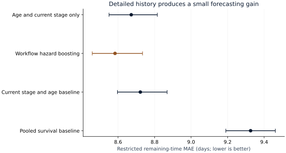
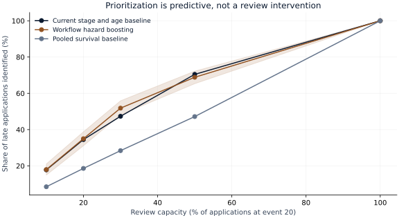

# S58 — Where business workflows accumulate delay

Run `S58-9dd9fde5-183c5e51` · analysis commit `9dd9fde5837bd032b6f3a13c5ae1e2ba7d768a05` · 2026-09-29.

## Decision and executive summary

Detailed workflow history improves delay forecasts only modestly over knowing an application's current stage and age. On 2,365 December applications, the selected survival model reduces average absolute forecasting error from **8.72 to 8.58 days**. The paired difference is **-0.139 days** (95% interval **-0.181 to -0.093**): about **1.6%**, or **3.3 hours less forecasting error**. This does not mean applications finished 3.3 hours faster.

An operations leader should use this as evidence for a bounded prioritization pilot, with a simple stage/age benchmark retained. At the twentieth event and 20% review capacity, the detailed model identifies 218 of 623 applications that remain unresolved after 14 days; the stage/age baseline identifies 215. The three-case point difference does not demonstrate that reviewing those applications will accelerate them.

The longest commonly observed stage gap is from A_Complete to A_Validating: a median 6.86 elapsed days across 266 observed transitions. That is a place to investigate process handoffs, not evidence of employee inefficiency or measured active service time. Operational staffing effects require an intervention or better arrival/service data.

## Evidence

| Model | Restricted-time MAE (days) | 95% interval | 14-day Brier score | 80% band coverage |
|---|---:|---:|---:|---:|
| Pooled survival baseline | 9.326 | 9.190–9.462 | 0.2455 | 91.4% |
| Current stage and age baseline | 8.722 | 8.597–8.869 | 0.2262 | 88.3% |
| Workflow hazard boosting | 8.583 | 8.459–8.734 | 0.2251 | 88.5% |
| Age and current stage only | 8.672 | 8.551–8.815 | 0.2245 | 88.5% |

The primary paired comparison is fixed in the protocol. Intervals use 500 application-cluster bootstrap draws, retaining related prefixes together. The reduced-history hazard model has a slightly better 14-day Brier score than the full-history model; the extra history does not dominate every metric. Nominal 80% bands cover 88.5% for the selected model, so their conservative coverage should not be called exact calibration.

All times are discrete remaining days capped at 30, ending at the first recorded A_Pending, A_Denied or A_Cancelled application status. This is not disbursement, final trace completion or an unrestricted-duration estimate. There are 6,247 eligible event prefixes across 2,365 final applications, including 183 prefixes with no observed endpoint before administrative follow-up ends. Every final prefix nevertheless has a complete 30-day horizon, so restricted-time error does not impute an unobserved tail.

## Data and timing

BPI Challenge 2017 contains 31,509 applications and 1,202,267 events. Related offers stay with their enclosing application. The audit finds no cross-application offer-reference conflicts, unordered traces or duplicated event IDs within an application. Lifecycle transitions remain distinct. Initial financial attributes, resource identities, application IDs and future statuses are excluded from predictors.

Applications opened January–August form development, September supplies validation, and December is the untouched final arrival cohort. Final training uses January–September applications with prefixes before November and outcomes through November 30. Prefix entry cutoffs ensure 30-day final follow-up. October/November applications do not enter final evaluation. Detailed eligibility counts, calendar cutoffs and source checksums appear in the artifact and [PROTOCOL.md](PROTOCOL.md).

Each application's available prefixes share total weight one. Stage/prefix diagnostic subsets retain those weights; they are not necessarily equal-weight cross-sections. Late-case capture uses one fixed-length prefix per application, so its counts are distinct applications. Diagnostic cells with fewer than 30 prefixes are withheld.

## Method and sensitivity

Two survival baselines are pooled Kaplan–Meier and current-stage/age-band Kaplan–Meier, with a pooled fallback for small training groups. The principal comparison is a discrete-time boosted hazard model, selected between 7 and 15 leaves using validation MAE only. The selected 15-leaf model and age/stage-only ablation are fitted once on final training. All preprocessing category mappings are training-only. Censored partial days contribute only complete observed risk intervals.

Per-model probability calibration bins, stage/prefix errors, band coverage and all capacity points are retained in the JSON. Intervals condition on fitted models, one institution and one test month; they exclude refitting, future regime uncertainty and simultaneous comparisons across all sliders.

## Workflow and capacity scenarios

| Recorded stage transition | Observations | Median elapsed days | 90th percentile |
|---|---:|---:|---:|
| A_Concept → A_Accepted | 2,217 | 0.221 | 1.808 |
| A_Create Application → A_Submitted | 1,573 | 0.000 | 0.000 |
| A_Submitted → A_Concept | 1,509 | 0.001 | 0.032 |
| A_Accepted → A_Complete | 1,320 | 0.003 | 0.008 |
| A_Create Application → A_Concept | 792 | 0.000 | 0.000 |
| A_Complete → A_Validating | 266 | 6.857 | 12.775 |

Consecutive application-stage events within the longest eligible final prefix per application; edges with fewer than30 occurrences omitted. Early prefixes do not show every later loop. Neither the map nor the forecast identifies causally removable waiting time.

The interactive capacity scenario is explicit arithmetic: `remaining days × ((1 − addressable share) + addressable share / capacity multiplier)`. Addressable share (0–100%) and capacity multiplier (0.5–2.0) are assumed. At the default zero addressable share, the scenario equals the saved forecast. The calculation is not a queueing model, promised improvement, measured savings or changed prediction accuracy. Scenario outputs can exceed 30 days when assumed capacity falls; that extrapolation has no fitted survival interpretation.

## Reproduce and source

See [README.md](README.md), [DATA.md](DATA.md), [PROTOCOL.md](PROTOCOL.md) and [result.json](results/result.json). Figures and this report derive from the saved result using `uv run python scripts/report_s58.py`. Raw records and individual predictions stay outside the repository. Numerical verification is separate from independent human technical review, which remains pending.

van Dongen, B. (2017): *BPI Challenge 2017*. Eindhoven University of Technology / 4TU.ResearchData. [Dataset DOI](https://doi.org/10.4121/uuid:5f3067df-f10b-45da-b98b-86ae4c7a310b). Reuse is subject to the dataset's [4TU General Terms of Use (2016)](https://ndownloader.figshare.com/files/24080255), including noncommercial use, source citation and bibliographic publication notification. No source records are redistributed.
